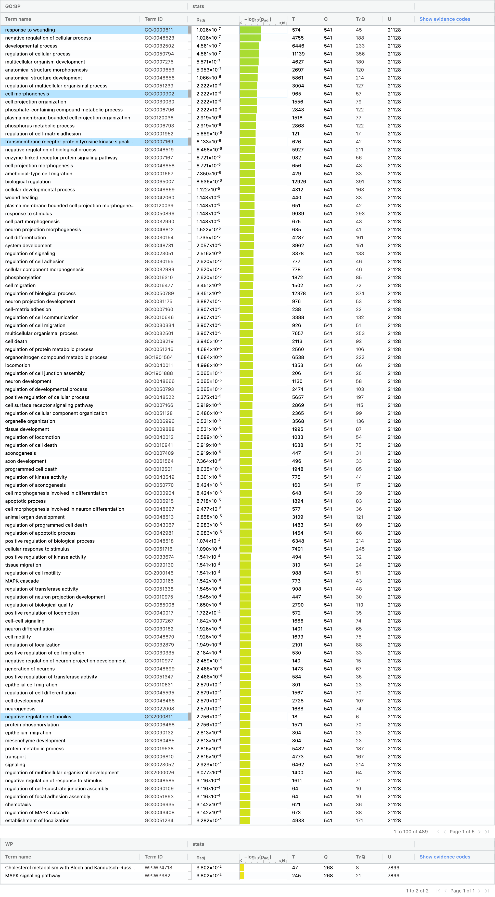
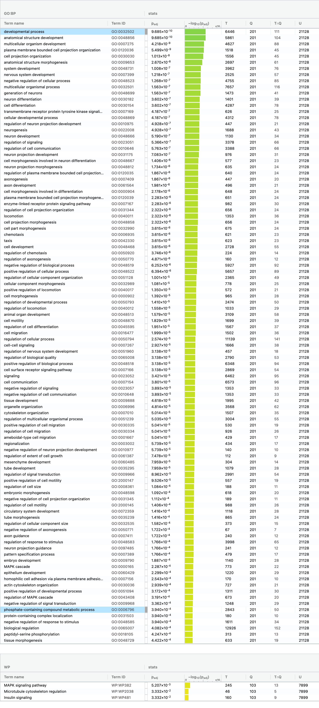
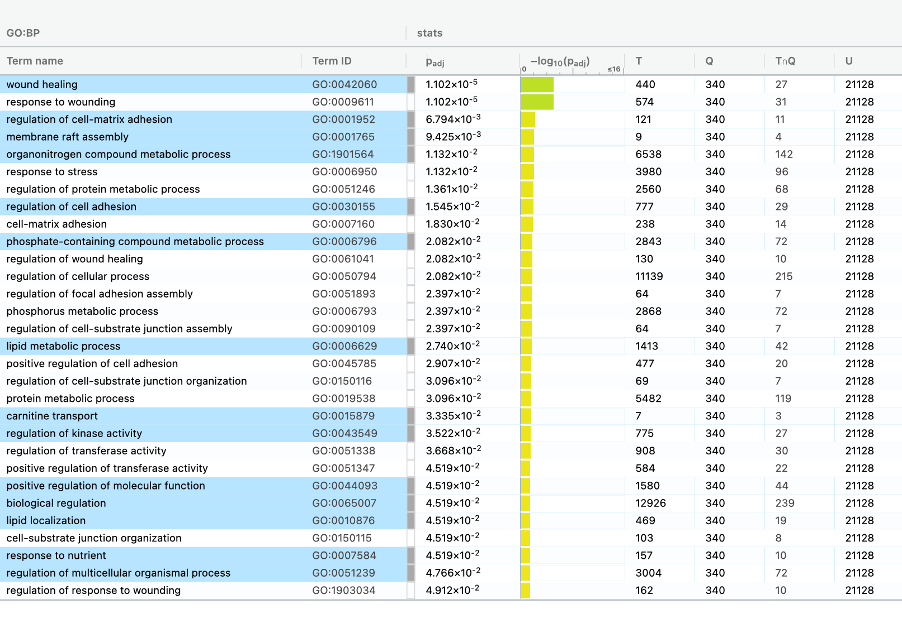

```{r setup, include=FALSE}
knitr::opts_chunk$set(echo = TRUE)
```

## Introduction 
The main aim of this assignment, A2, is to conduct differential gene expression 
using the normalized data-set from A1. We then rank the genes according to the 
differential expression. Using the ranked list we then conduct thresholded over 
representation analysis to highlight dominant themes in the top set of genes. 

## Data Overview 
The data we use for the assignment will be the normalized counts data derived from normalizing the raw counts data from GEO152323. The original raw counts dataset was generated through an RNA-seq assay where the researchers transfected MCF7 cells with either control siRNA or siRNAs against RECQ1 or ESR1. 

## Load required Packages 
```{r requiredPackages, warning=FALSE, message=FALSE}
if (!require('ggplot2')) {
  install.packages('ggplot2')
  library('ggplot2')
}
if (!require('ComplexHeatmap')) {
  install.packages('ComplexHeatmap')
}
if (!require('cowplot')) {
  install.packages('cowplot')
}
if (!require('plotly')) {
  install.packages('plotly')
}
```

## Load Data

We normalized the raw counts data in Assignment 1 using the edgeR package and saved the normalized data as a csv file called 'normalized_counts.csv'. This data has a column for ensemble gene ids as well as hgnc symbols.

```{r warning=FALSE, message=FALSE}
normalized_counts <- read.csv(file = "normalized_counts.csv")
```

In the paper the authors made two separate comparisons, these comparisons were
CTL vs RECQ1 siRNA and CTL vs ESR1 siRNA. Essentially an siRNA is made to target a
specific gene and it knocks that gene out, so no protein can be made by that gene. 

Hence, we will partition the data set into CTL-RECQ1 and CTL-ESR1. This will allow 
us to conduct differential gene expression CTL vs RECQ1 and CTL vs ESR1.

### Partiton Data (Preparation)

```{r warning=FALSE, message=FALSE}
# remove the first row in both since that row is of no use to us

# remove rows 4, 5 and 10 for CTL - RECQ1 
normalized_counts_RECQ1_CTL <- normalized_counts[, -c(1, 4, 5, 10)]

# remove rows 7, 8 and 12 for CTL - ESR1
normalized_counts_ESR1_CTL <- normalized_counts[, -c(1, 7, 8, 12)]


```

In the MDS plot from A1 we see that there is clustering according to the cell type
whether the cell type was control or not. 
So the model we use for differential expression must account for that.
It also must account for the patient/replicate.

## Differential Gene Expression

### Prepare model for Differential Expression

```{r warning=FALSE, message=FALSE}

# Defining the groups - code from lecture
samples <- data.frame(lapply(colnames(normalized_counts_RECQ1_CTL)[3:8],
                             FUN=function(x){unlist(strsplit(x, split="\\_"))[c(2,4)]}))
colnames(samples) <- colnames(normalized_counts_RECQ1_CTL)[3:8]
rownames(samples) <- c("cell_type", "patients")
samples <- data.frame(t(samples))

# Order the data so that the common cell types are together and the patients are
# in ascending order in the data frame
samples <- arrange(samples, rownames(samples))

# The model design for the differential expression is taking into account the 
# cell types and patients in its design
model_design_RECQ1_CTL <- model.matrix(~ samples$patients)

```

### Conduct Differential gene expression using limma 

```{r warning=FALSE, message=FALSE}
# Create the matrix for getting p-values
expressionMatrix <- as.matrix(normalized_counts_RECQ1_CTL[,3:8])
rownames(expressionMatrix) <-
  normalized_counts_RECQ1_CTL$ensembl_gene_id
colnames(expressionMatrix) <-
  colnames(normalized_counts_RECQ1_CTL)[3:8]

# Creating a minimal set using the Biobase package in R
MinSet <- Biobase::ExpressionSet(assayData = expressionMatrix)

fit <- limma::lmFit(MinSet, model_design_RECQ1_CTL)

fit2 <- limma::eBayes(fit, trend = TRUE)


topfit <- limma::topTable(fit2,
                   coef=ncol(model_design_RECQ1_CTL),
                   adjust.method = "BH",
                   number = nrow(expressionMatrix))

output_hits <- merge(normalized_counts_RECQ1_CTL[,1:2],
                     topfit,
                     by.y=0,by.x=1,
                     all.y=TRUE)

output_hits <- output_hits[order(output_hits$P.Value),]

```

**How many genes were significantly differentially expressed? What thresholds did you use and why?**

Number of genes that were significantly expressed: `r length(which(output_hits$P.Value < 0.05))`\
We used a threshold P-value of 0.05 as that is the standard P value used in statistics.

**Multiple hypothesis testing - correct your p-values using a multiple hypothesis correction method. Which method did you use? And Why? How many genes passed correction?**

Used the Benjamin Hochberg methods for multiple hypothesis testing since it is suitable for the data set and for dealing with a large number of hypotheses.
Number of genes that passed correction: `r length(which(output_hits$adj.P.Val < 0.05))`\


### Preparing data for MA plot
```{r warning=FALSE, message=FALSE}

logFC <- topfit[, -c(3, 4, 5, 6)]
logPval <- topfit[, -c(1, 3, 5, 6)]
logPval <- -log10(logPval$P.Value)


# MA plot
plot(logPval, logFC$logFC, xlab="log P val", ylab="log-fold-change", main = "MA plot: RECQ1 siRNA vs CTL")


```

**Figure 1: MA plot. The circles represent genes, genes that are not clustered in the middle show that they are either up regulated or down regulated ** 


### HeatMap of TopHits

```{r warning=FALSE, message=FALSE}
# Create a heatmap

topHits <- output_hits[which(output_hits$P.Value < 0.05),]

heatmap_matrix <- normalized_counts_RECQ1_CTL

heatmap_matrix_tophits <- t(
  scale(t(heatmap_matrix[
    which(rownames(heatmap_matrix) %in% rownames(topHits)), 3:8])))

if(min(heatmap_matrix_tophits) == 0){
    heatmap_col = circlize::colorRamp2(c( 0, max(heatmap_matrix_tophits)), 
                             c( "white", "red"))
  } else {
    heatmap_col = circlize::colorRamp2(c(min(heatmap_matrix_tophits), 0,
      max(heatmap_matrix_tophits)), c("blue", "white", "red"))
  }
current_heatmap <- Heatmap(as.matrix(heatmap_matrix_tophits),
                           cluster_rows = TRUE,
                           cluster_columns = TRUE,
                               show_row_dend = TRUE,
                               show_column_dend = TRUE, 
                               col=heatmap_col,
                               show_column_names = TRUE, 
                               show_row_names = FALSE,
                               show_heatmap_legend = TRUE,
                               )
current_heatmap

```

**Figure 2: Heatmap showing results of RNA seq expression data. The columns show whether the cells were control or transfected with siRNA against RECQ1. Red shows more expression of gene while blue shows low expression. ** 


**Do you conditions cluster together? Explain why or why not.**

The conditions do cluster together. Since there is gene expression relating to whether CTL or RECQ1 siRNA was used.

## Thresholded over-representation analysis

```{r warning=FALSE, message=FALSE}

downregulated <- output_hits$ensembl_gene_id[which(output_hits$logFC < 0 &
                                                    output_hits$P.Val < 0.05)]
upregulated <- output_hits$ensembl_gene_id[which(output_hits$logFC > 0 &
                                                  output_hits$P.Val < 0.05)]
mix <- output_hits$ensembl_gene_id[which(output_hits$P.Value < 0.05)]


write.table(x=mix,
            file=file.path("mix.txt"),sep = "\t",
            row.names = FALSE,col.names = FALSE,quote = FALSE)
write.table(x=upregulated,
            file=file.path("upregulated.txt"),sep = "\t",
            row.names = FALSE,col.names = FALSE,quote = FALSE)
write.table(x=downregulated,
            file=file.path("downregulated.txt"),sep = "\t",
            row.names = FALSE,col.names = FALSE,quote = FALSE)

```

### Questions and Answers

**1. Which method and Why?**

To conduct the thresholded over-representation analysis, I chose the g:profiler since the homework made me familiar with the tool. 

**2. What annotation data did you use and why? What version of the annotation are you using?**

I chose to GO:BP and WikiPathways (WP). 

**3.How many genesets were returned with what thresholds?**

For the GO:BP 489 genesets were returned and for WikiPathways (WP) 2 genesets were returned.

{width=50%}

**4. Run the analysis using the up-regulated set of genes, and the down-regulated set of genes separately. How do these results compare to using the whole list (i.e all differentially expressed genes together vs. the up-regulated and down regulated differentially expressed genes separately)?**

Running the analysis using the up regulated set of genes returned 439 genesets for GO:BP and 3 genesets for WP 3. The top term was "development protein" in GO:BP and "MAPK signalling pathway" in WP.

{width=50%}

Running the analysis using the down regulated set of genes returned 30 genesets for GO:BP and 0 for WP. The top term was "wound healing" in GO:BP.

{width=50%}

In the mixed list the top term in GO:BP was response to "wound healing" and in WP it was response to "Cholesterol metabolism with Bloch and Kandutsch-Russell pathways". 

## Interpretation

**1. Do the over-representation results support conclusions or mechanism discussed in the original paper?**

Yes, the over-representation results support the conclusions or mechanisms disussed in the original paper.

**2. Can you find evidence, i.e. publications, to support some of the results that you see. How does this evidence support your results.**

We looked at the following article,  Wei, R., Zhao, M., Zheng, CH. et al. Concordance between somatic copy number loss and down-regulated expression: A pan-cancer study of cancer predisposition genes. Sci Rep 6, 37358 (2016). https://doi.org/10.1038/srep37358

The article talks about how the 'regulation of cell matrix adhesion' pathway GO:0001952, which shows us as the third term for the downregulated set, may have an effect on carcinogenesis.

If the genes for that pathway are downregulated then there is an increase in carcinogenisis. 


## References

Lu X, Redon CE, Tang W, et al. Genome-Wide Analysis Unveils DNA Helicase RECQ1 as a Regulator of Estrogen Response Pathway in Breast Cancer Cells. Mol Cell Biol. 2021;41(4):e00515-20. Published 2021 Mar 24. doi:10.1128/MCB.00515-20

Orchestrating high-throughput genomic analysis with Bioconductor. W. Huber, V.J. Carey, R. Gentleman,
..., M. Morgan Nature Methods, 2015:12, 115.
  
Gu, Z. (2014) circlize implements and enhances circular visualization in R. Bioinformatics.

Ritchie, M.E., Phipson, B., Wu, D., Hu, Y., Law, C.W., Shi, W., and Smyth, G.K. (2015). limma powers
differential expression analyses for RNA-sequencing and microarray studies. Nucleic Acids Research
43(7), e47.
  
Gu, Z. (2016) Complex heatmaps reveal patterns and correlations in multidimensional genomic data.
Bioinformatics.

C. Sievert. Interactive Web-Based Data Visualization with R, plotly, and shiny. Chapman and Hall/CRC
Florida, 2020.

H. Wickham. ggplot2: Elegant Graphics for Data Analysis. Springer-Verlag New York, 2016.

Wilke C (2020). _cowplot: Streamlined Plot Theme and Plot Annotations for 'ggplot2'_. R package version
1.1.1, <https://CRAN.R-project.org/package=cowplot>.

