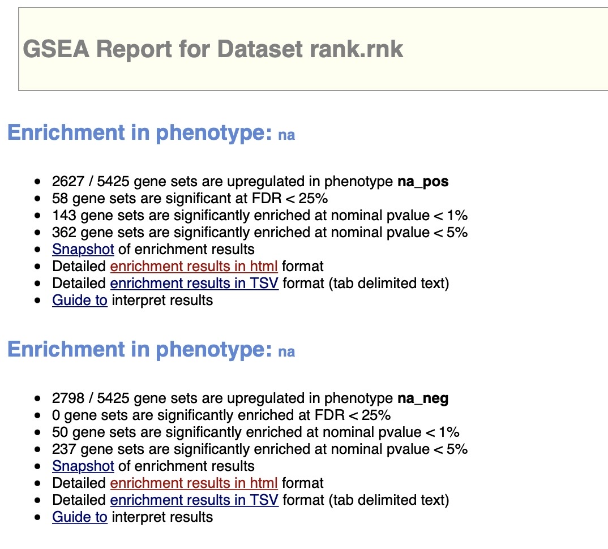

```{r setup, include=FALSE}
knitr::opts_chunk$set(echo = TRUE)
```

## Introduction 
The main aim of this assignment is to conduct non-thresholded pathway analysis and summarize and visualise the results using Cytoscape and Enrichment map pipeline. To conduct the non-thresholded pathway analysis we will use the ranked data that we created in A2. 
To give a little background, in A1 we took the raw counts data and normalized the data set. Then in A2 we took that normalized data and performed differential gene expression using the limma package. 


## Data Overview 
The data we use for the assignment will be the ranked data derived from our A2. The original raw counts dataset was generated through an RNA-seq assay where the researchers transfected MCF7 cells with either control siRNA or siRNAs against RECQ1 or ESR1. The raw counts data was derived from GEO152323.

## Non thresholded Gene set Enrichment Analysis

**1. What method did you use? What genesets did you use? Make sure to specify versions and cite your methods.**

In order to conduct the Gene set Enrichment Analysis, I made use of GSEA version 4.3.2 and ran the GSEA pre-ranked analysis using that tool. The genesets I used were curated by the Baderlab, I used the most recent version of the human genesets available. The name of the exact gmt file is Human_GOBP_AllPathways_no_GO_iea_March_02_2023_symbol.gmt. The genset is from March 2nd 2023.

To run the GSEA pre-ranked analysis, I used the following parameters:

* Number of permutations: 1000
* Maximum geneset size: 500
* Minimum geneset size: 15
* Collapse/Remap to gene symbols: No_Collapse


**2. Summarize your enrichment results.**

The positive phenotype are the genes that are upregulated, while the negative phenotype are the genes that are downregulated.

For the upregulated genes 2627/5425 genesets were upregulated. 58 genesets were significant with FDR < 25%. 143 genesets significantly enriched at a nominal p-value < 1%. 362 genesets are significantly enriched with a nominal p-value < 5%.

For the downregulated genes, 2798/5425 genesets were downregulated. 0 genesets were significantly enriched with FDR < 25%. 50 genesets were significantly enriched at a nominal p-value < 1%. 237 genesets significantly enriched with a nominal p-value < 5%.




**3. How do these results compare to the results from the thresholded analysis in Assignment #2. Compare qualitatively. Is this a straight forward comparison? Why or why not?**

When we compare the results from our thresholded analysis from Assignment #2, we can see that there are some similarities as to the genesets that are returned to us in the upregulated and downregulated genesets. However, there are differences as well, due to the fact that our GSEA pre-ranked analysis took in all of the genes while the g:Profiler only looked at a subset of genes that were significantly expressed. Hence, the comparison is not straight forward.


If we look at the GSEA results for the positive phenotype (upregulated genesets) and compare that with the results of the upregulated genesets from g:profiler we can see that both return gene sets that are involved in cell development, cell-cell adhesion e.t.c. 


If we look at the GSEA results for the negative phenotype (downregulated genesets) and compare that with the results of the downregulated genesets from g:profiler we can some genesets that are similar. The geneset involved with hallmark estrigen response is no.1 for the GSEA pre-ranked analysis.


## Visualize Gene set Enrichment Analysis in Cytoscape

**1.Create an enrichment map - how many nodes and how many edges in the resulting map? What thresholds were used to create this map? Make sure to record all thresholds. Include a screenshot of your network prior to manual layout. **

Cytoscape version 3.9.1 was downloaded.

To create the enrichment map, I first installed the EnrichmentMap application in cytoscape. This application was developed by the bader lab. Next, I supplied the EnrichmentMap with the GSEA pre-ranked output file. The application automatically grabbed other files which it needed. These included the rank file and the geneset file which was used for the GSEA pre-ranked analysis.

The enrichment map has 58 nodes and 34 edges.

I used the following thresholds to create the map

* Node cutoff p-value: 0.05
* Edge cutoff value: 0.375

EnrichmentMap creation parameters

* P-value: 1.0
* FDR Q-value: 0.25
* Jaccard overlap combined: 0.375

Note: Only up regulated genesets are present since only they passed the threshold values.


**2. Annotate your network - what parameters did you use to annotate the network. If you are using the default parameters make sure to list them as well.**

To annotate the network I installed the AutoAnnotate app from the available apps in Cytoscape. The following parameters were used:

* Annotate entire network
* Use clusterMaker App
* Label column: GS_DESCR
* Cluster algorithm: MCL Cluster
* Edge weight column: similarity_coefficient
* Normalization Factor: 0.5
* Cluster Cutoff: 1.0


**3. Make a publication ready figure - include this figure with proper legends in your notebook.**


**4. Collapse your network to a theme network. What are the major themes present in this analysis? Do they fit with the model? Are there any novel pathways or themes?**

The network was collapsed to a theme network using AutoAnnotate's coSE Cluster Layout, as shown in Figure 7. Major themes are represented by large clusters of gene sets/nodes with a high number of connections/edges, with two being particularly relevant:

* Mitotic spindle organisation
* Sperm motility celium

The mitotic spindle organisation being up regulated fits with the model. 


## Interpretation

**1. Do the enrichment results support conclusions or mechanism discussed in the original paper? How do these results differ from the results you got from Assignment #2 thresholded methods?**

Yes, the enrichment results support the conclusions or mechanism discussed in the original paper. We see in the downregulated genesets, Estrogen response is the top term and this is mentioned heavily in the paper. 

The results of the GSEA provide us with more information as to which genesets are upregulated and downregualed respectively.


**2. Can you find evidence, i.e. publications, to support some of the results that you see. How does this evidence support your result?**

The paper 'The p38 Pathway: From Biology to Cancer Therapy' by Martinez-Limon, et al. talks about how the p38 MAPK pathway can promote tumor growth. The geneset corresponding to p38 MAPK is upregulated.


**3. Choose a specific pathway or theme to investigate in more detail. Why did you choose this pathway or theme? Show the pathway or theme as a gene network or as a pathway diagram. Annotate the network or pathway with your original log fold expression values and p-values to show how it is effected in your model.**

I chose to investigate the regulation of spindle organisation pathway in detail. I chose this since it was part of a significant theme and the node itself was quite significant. 

The gene network map was created using the GeneMania app in cytoscape. 


## References

Lu X, Redon CE, Tang W, et al. Genome-Wide Analysis Unveils DNA Helicase RECQ1 as a Regulator of Estrogen Response Pathway in Breast Cancer Cells. Mol Cell Biol. 2021;41(4):e00515-20. Published 2021 Mar 24. doi:10.1128/MCB.00515-20

Montojo, J., Zuberi, K., Rodriguez, H., Kazi, F., Wright, G., Donaldson, S. L., Morris, Q., & Bader, G. D. (2010). GeneMANIA Cytoscape plugin: fast gene function predictions on the desktop. Bioinformatics (Oxford, England), 26(22), 2927–2928. https://doi.org/10.1093/bioinformatics/btq562

Isserlin, R. (2023). Lecture 10 - Recap and GSA. Quercus.
https://q.utoronto.ca/courses/294979/files/24035557?module_item_id=4287874&fd_cookie_set=1

Isserlin, R. (2023). Lecture 11 -Enrichment Map and other Cytoscape Appsother Cytoscape Apps. Quercus. https://q.utoronto.ca/courses/294979/files/24035526?module_item_id=4287888

Isserlin, R. (2023). Lecture 12 -Enrichment Map and other Cytoscape Appsother Cytoscape Apps. Quercus. https://q.utoronto.ca/courses/294979/files/24035559?module_item_id=4287901

Merico, D., Isserlin, R., Stueker, O., Emili, A., & Bader, G. D. (2010). Enrichment map: a network-based method for gene-set enrichment visualization and interpretation. PloS one, 5(11), e13984. https://doi.org/10.1371/journal.pone.0013984

Subramanian, A., Tamayo, P., Mootha, V. K., Mukherjee, S., Ebert, B. L., Gillette, M. A., Paulovich, A., Pomeroy, S. L., Golub, T. R., Lander, E. S., & Mesirov, J. P. (2005). Gene set enrichment analysis: a knowledge-based approach for interpreting genome-wide expression profiles. Proceedings of the National Academy of Sciences of the United States of America, 102(43), 15545–15550. https://doi.org/10.1073/pnas.0506580102

Martínez-Limón, A., Joaquin, M., Caballero, M., Posas, F., & de Nadal, E. (2020). The p38 Pathway: From Biology to Cancer Therapy. International journal of molecular sciences, 21(6), 1913. https://doi.org/10.3390/ijms21061913


